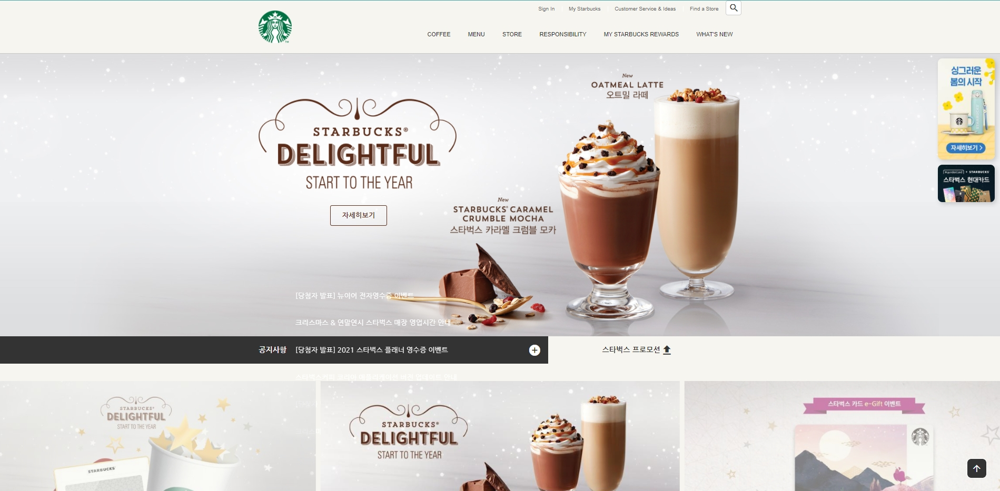
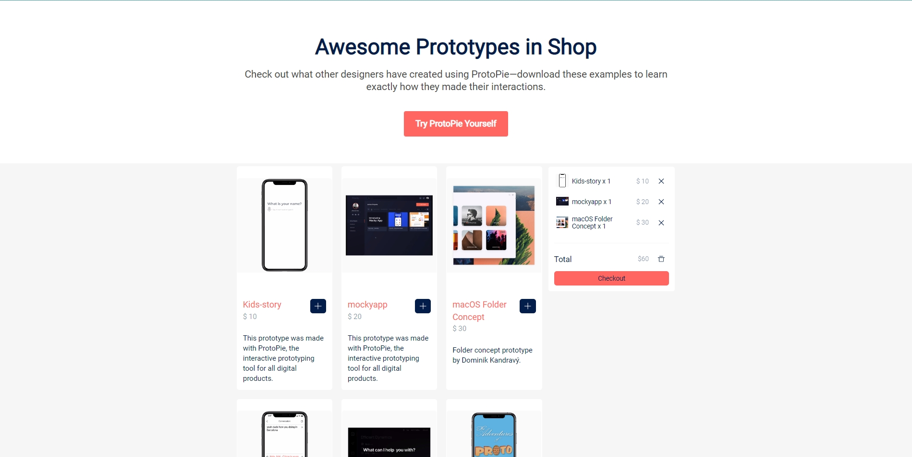

# 작업 결과물

## Starbucks Clone Coding

| 프로젝트 이름 | 사용기술                                | 주소                                                                  |
| ------------- | --------------------------------------- | --------------------------------------------------------------------- |
| 스타벅스      | - HTML  - CSS  - JS  - DOM  | [Startbucks](https://github.com/ParkYoungWoong/starbucks-vanilla-app) |

## Shop React Develop

| 프로젝트 이름 | 사용기술              | 주소                                                                                                        |
| ------------- | --------------------- | ----------------------------------------------------------------------------------------------------------- |
| 쇼핑몰        | - React  - CSS  | [Prototype-Shop](https://github.com/tonyhan18/FastCampusStudy/tree/master/FrontEnd/Woongjae/prototype-shop) |

# 패캠 학습내용 정리 깃헙

이곳에는 tonyhan이 패캠을 통해 학습했던 내용들이 저장됩니다. 
혹은 개인 학습용으로 공부한 내용들이 이 곳에 저장됩니다. 
 

# 학습한내용

| 강의 명                                               | 깃헙주소                                                                      | 강의주소                                             |
| :---------------------------------------------------- | :---------------------------------------------------------------------------- | :--------------------------------------------------- |
| ● 한 번에 끝내는 프론트엔드 개발 초격차 패키지 Online | [FrontEnd](https://github.com/tonyhan18/FastCampusStudy/tree/master/FrontEnd) | [link](https://fastcampus.co.kr/dev_online_frontend) |
| ● 한 번에 끝내는 프론트엔드 개발 초격차 패키지 Online | BackEnd                                                                       | [link](https://fastcampus.co.kr/dev_online_javaend)  |
| ● 추가적인 웹 개발                                    | [React_Advanced](https://github.com/tonyhan18/React_Nepp)                     | [link](https://github.com/tonyhan18/React_Nepp)      |
